# Welcome to Basic Penetration Testing Room in THM

Let's enable the OpenVPN and begin the room

  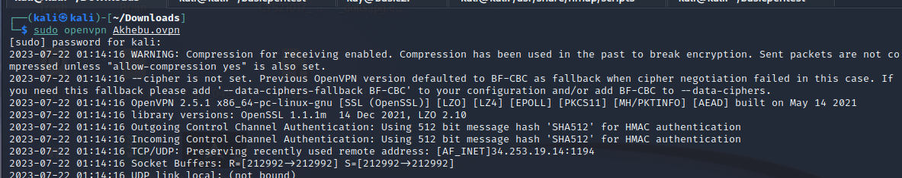  
<h6><i>Connect the OpenVpn in your terminal.</i></h6>

  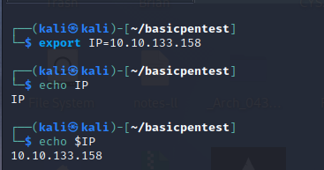  
<h6><i>02_Export the IP address.</i></h6>

  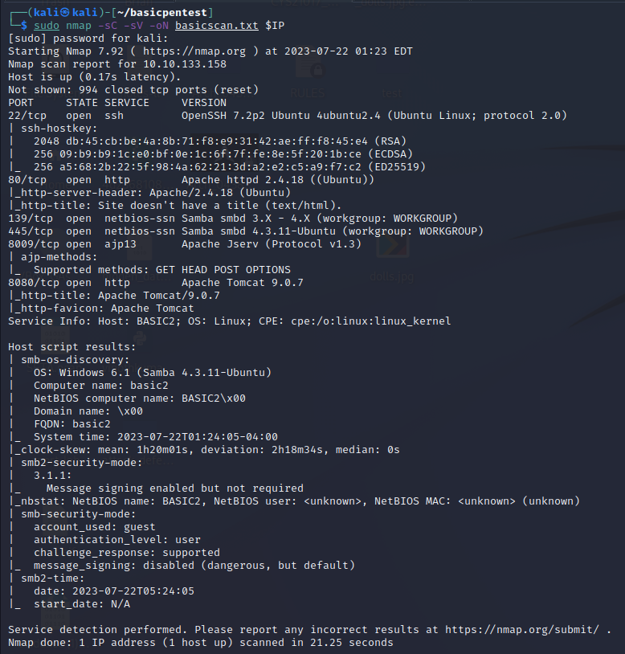  
<h6><i>Scan the IP address with Nmap.</i></h6>

  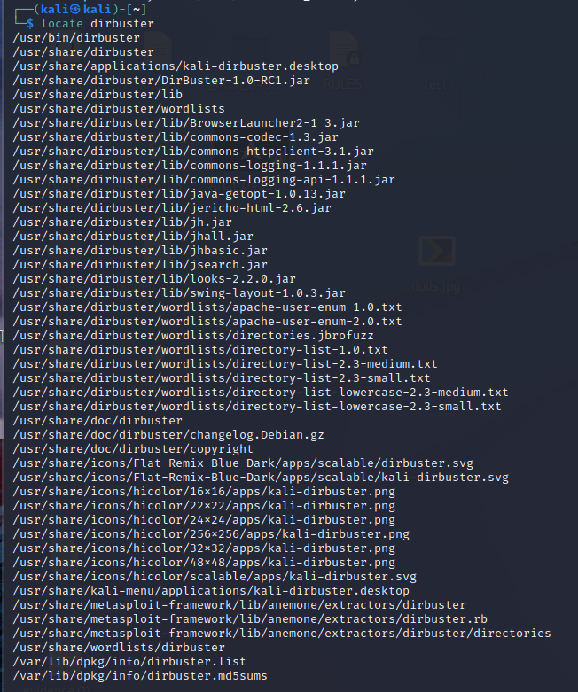  
<h6><i>Locate dirbuster inorder to find the wordlist</i></h6>

  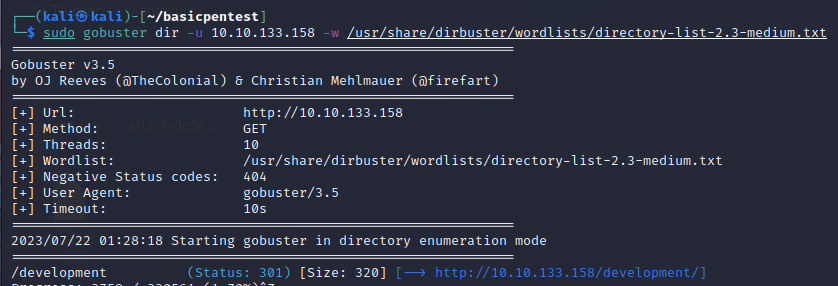  
<h6><i>Use gobuster to find the server.</i></h6>

  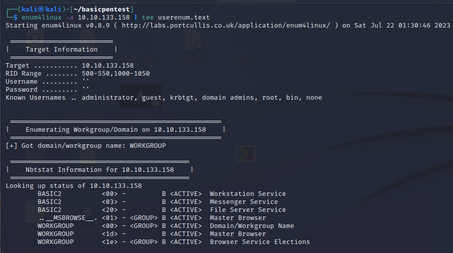  
<h6><i>enumerate the user list.</i></h6>

  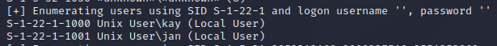  
<h6><i>enumerate the user list.</i></h6>

  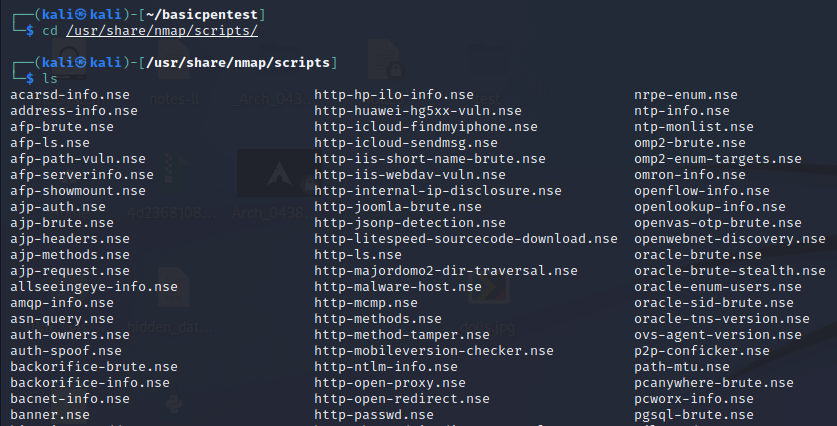  
<h6><i>Locate the nmap scripts.</i></h6>

  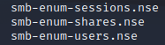  
<h6><i>Locate the nmap scripts for smb.</i></h6>

  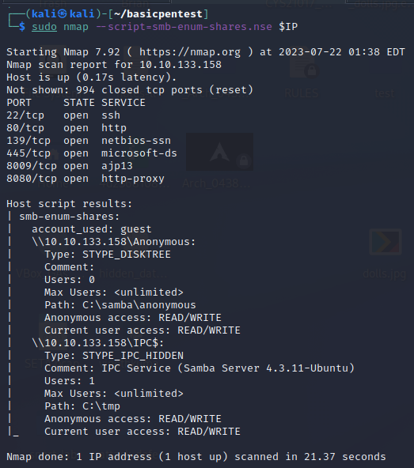  
<h6><i>Use the Nmap script of smb for the target IP address.</i></h6>

  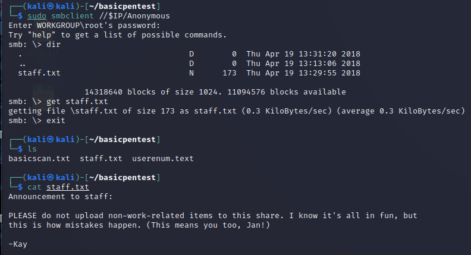  
<h6><i>Connected to the server and obtain staff list.</i></h6>

  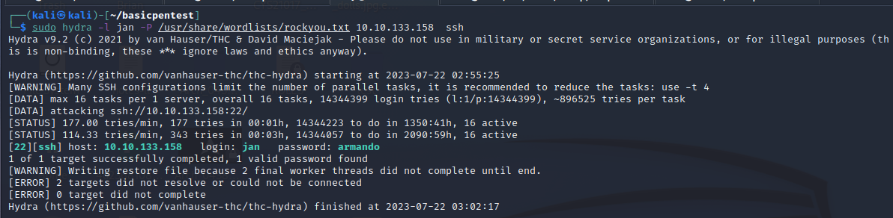  
<h6><i>Use Hydra to crack jan password.</i></h6>

  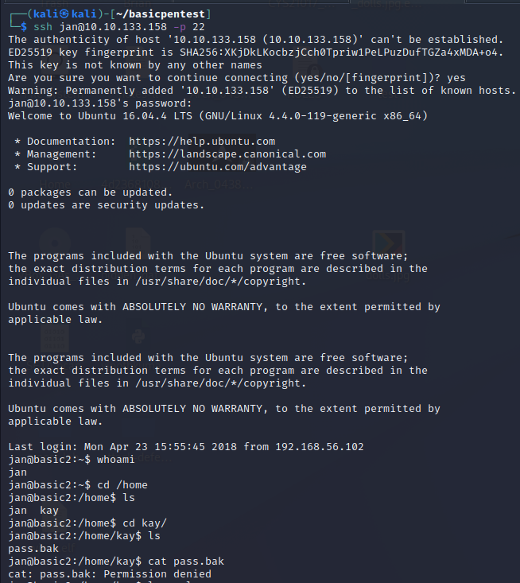  
<h6><i>With ssh of jan along with IP address of the target, now can get connected.</i></h6>

  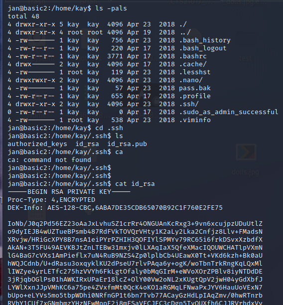  
<h6><i>ssh jan check password for kay user.</i></h6>

  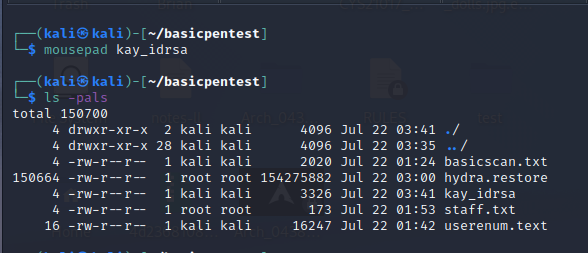  
<h6><i>Copy and paste the rsa key in a mousepad.</i></h6>

  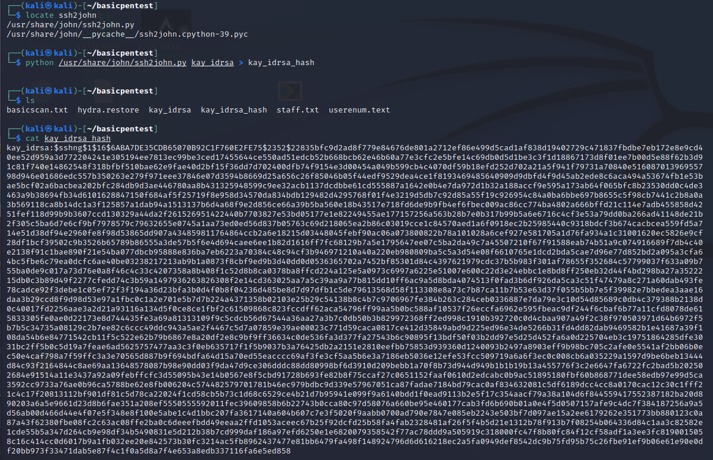  
<h6><i>Use python to create ssh2john inorder to get the hash of the key.</i></h6>

  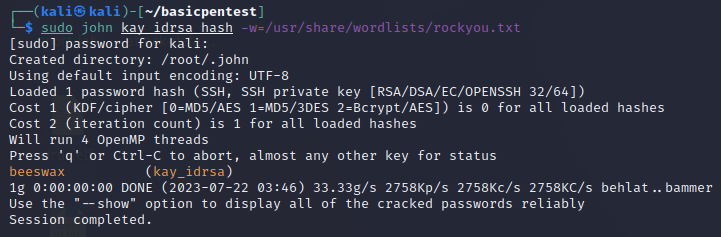  
<h6><i>Use john to crack the password for kay user.</i></h6>

  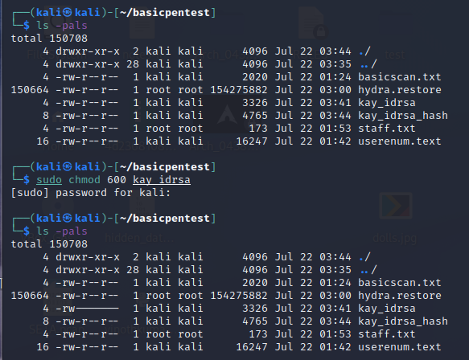  
<h6><i>Change the permission for the kay user idrsa key file.</i></h6>

  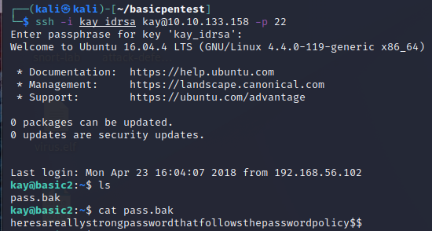  
<h6><i>Got access to kay user password file.</i></h6>

